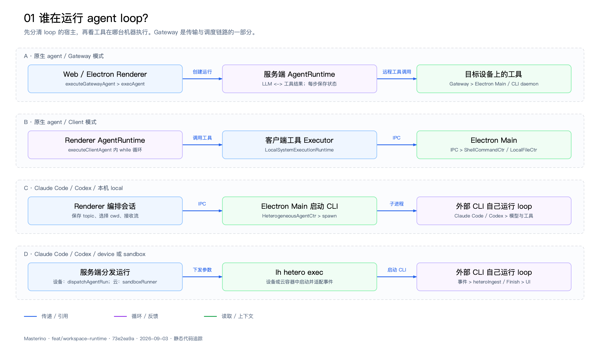
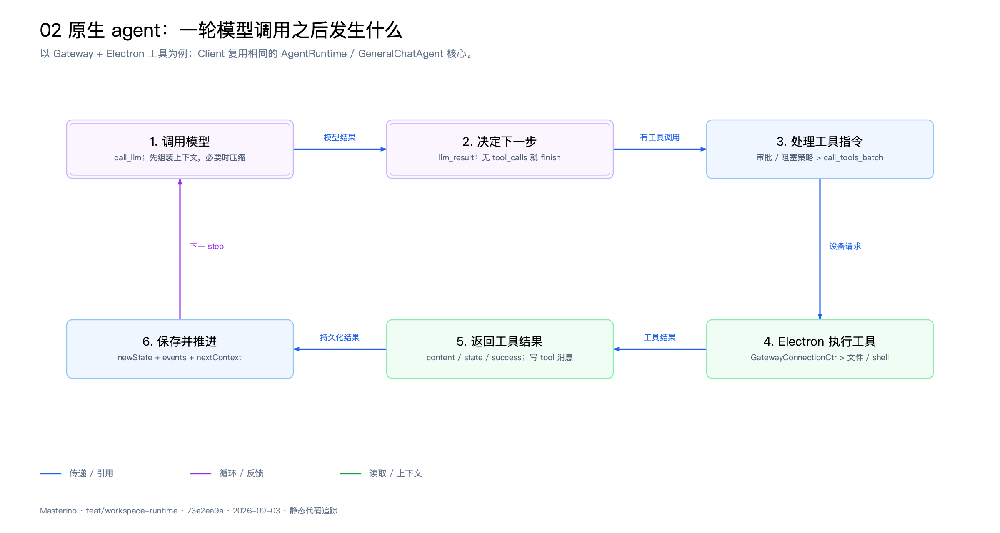
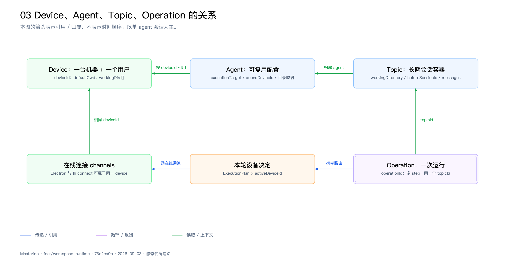
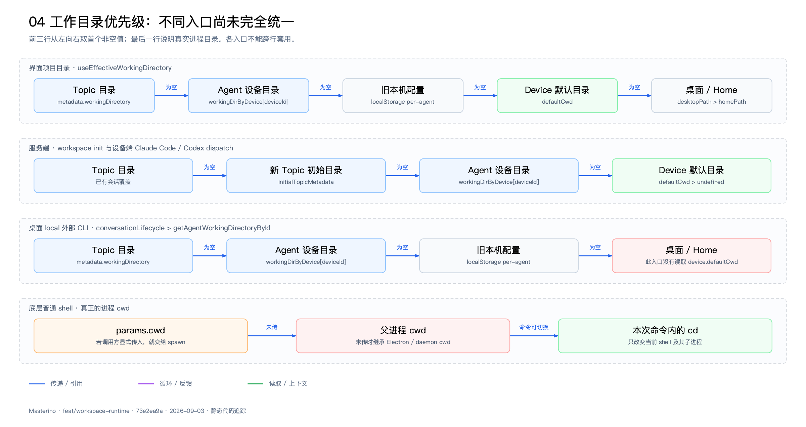
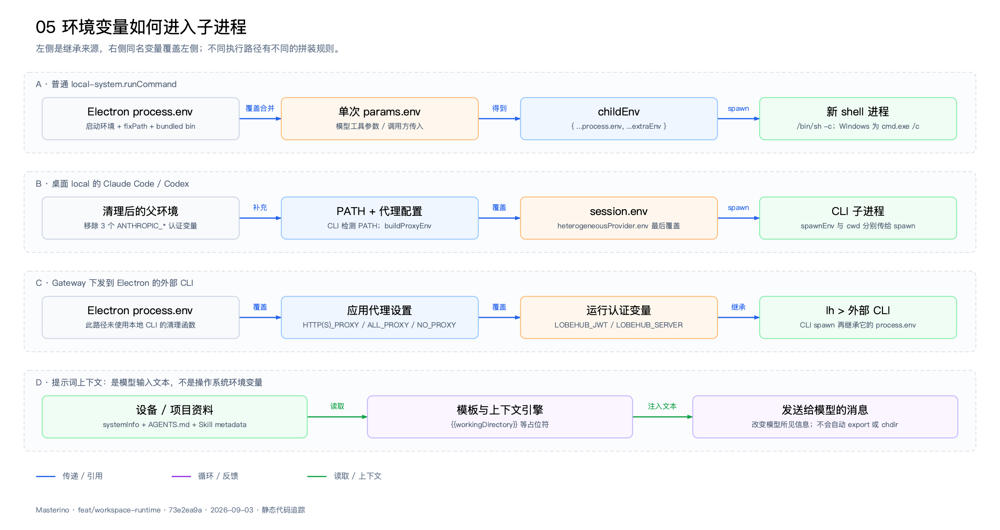
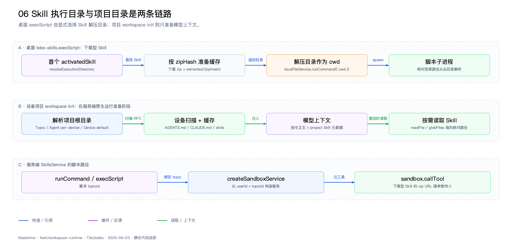
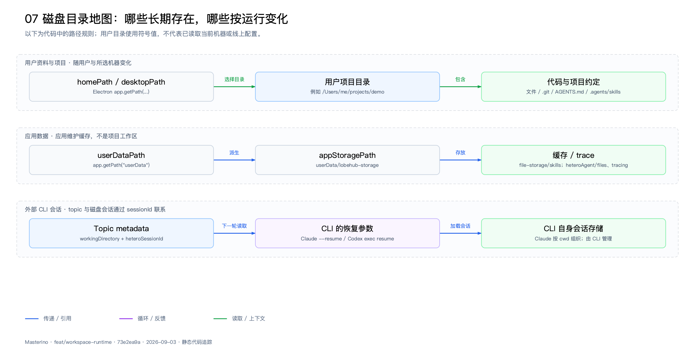

# Masterino Agent Loop、设备、Topic 与执行目录图谱

依据 `feat/workspace-runtime` 的历史提交 `73e2ea9a09cca9194131b54887c48c15c3755a81`；2026-09-03。该图谱记录 Workspace Runtime v2 全面改造前的执行链路基线，用于与后续实现对照，不代表当前分支 HEAD。分析未读取用户凭据或假设生产开关。

[打开交互图谱](index.html)。每张图另有 SVG、PNG、可平移缩放的独立 HTML 和可再生成的 JSON。

> 历史基线结论：先区分 loop 宿主与工具执行设备；再分别追踪项目目录、提示词目录、spawn cwd 和 env。在该提交上，不同入口之间仍有差异。

## 01  谁在运行 agent loop？

“在 Electron 中聊天”不足以判断 loop 在哪里。原生 agent、外部 CLI，以及是否启用 Gateway，是三个不同维度。

- selectRuntimeType 的优先级是 parentRuntime 显式覆盖 → 外部 agent 路由 → Gateway → Client。
- 原生 agent 是否走 Gateway，取决于 agentGatewayUrl、enableGatewayMode 和 disableGatewayMode；图中没有假设当前线上开关值。
- 本机 local 与 device=本机仍是两条链路：对外部 CLI，前者直接 IPC，后者经服务端与 Gateway，便于其它客户端观看。
- OpenClaw / Hermes 等远端 agent 总是经 Gateway，平台自身可能另外管理工作区。

| 概念 | 决定什么 | 不要混同 |
| --- | --- | --- |
| runtimeType | client / gateway / hetero：谁驱动这次运行 | 不等于执行设备 |
| executionTarget | none / local / device / sandbox：运行工具的位置意图 | 不等于 loop 一定在云端 |
| ExecutionPlan | 服务端得到 device / device-unrouted / none / sandbox | 是解析后的本轮决定 |
| AGENT_RUNTIME_MODE | 服务端内部 local queue 或 QStash queue | 这里 local 不是用户的 Electron |

代码依据：

- [src/store/chat/slices/aiChat/actions/agentDispatcher.ts:94](https://github.com/chaaak6/Masterino/blob/73e2ea9a09cca9194131b54887c48c15c3755a81/src/store/chat/slices/aiChat/actions/agentDispatcher.ts#L94)
- [src/store/chat/slices/aiChat/actions/gateway.ts:275](https://github.com/chaaak6/Masterino/blob/73e2ea9a09cca9194131b54887c48c15c3755a81/src/store/chat/slices/aiChat/actions/gateway.ts#L275)
- [src/store/chat/slices/aiChat/actions/streamingExecutor.ts:597](https://github.com/chaaak6/Masterino/blob/73e2ea9a09cca9194131b54887c48c15c3755a81/src/store/chat/slices/aiChat/actions/streamingExecutor.ts#L597)
- [src/helpers/executionTarget.ts:192](https://github.com/chaaak6/Masterino/blob/73e2ea9a09cca9194131b54887c48c15c3755a81/src/helpers/executionTarget.ts#L192)
- [apps/desktop/src/main/controllers/GatewayConnectionCtr.ts:282](https://github.com/chaaak6/Masterino/blob/73e2ea9a09cca9194131b54887c48c15c3755a81/apps/desktop/src/main/controllers/GatewayConnectionCtr.ts#L282)

## 02  原生 agent：一轮模型调用之后发生什么

一次用户发言通常创建一个 operation；这个 operation 内会进行很多 step。step 是“规划并执行指令”的单位，并不等于一次完整的 LLM→工具→LLM 循环。

- AgentRuntime.step 克隆 state、递增 stepCount，调用 GeneralChatAgent.runner，执行返回的 instruction，并产生 newState / events / nextContext。
- GeneralChatAgent 在 user_input 与 tools_batch_result 等阶段进入下一次 LLM；有 tool_calls 时先应用审批策略；无工具时 finish。
- 服务端在 step 前可补全设备上下文，step 后保存结果并决定是否再次 scheduleMessage。Client 则在 Renderer 内执行 while 循环。
- 等待审批、等待异步子 agent、用户中断、错误与结束都会改变推进方式；等待态不会被当作普通下一步不停重跑。
- 普通 runCommand 的 shell_id 只标识一次子进程及输出缓存。getCommandOutput 观察同一个进程；下一次 runCommand 新建进程。

| 层 | 职责 | 主要实现 |
| --- | --- | --- |
| 决策核心 | 根据 phase/state 选择 instruction | GeneralChatAgent.runner |
| 执行核心 | 执行 instruction 并产生事件与下一上下文 | AgentRuntime.step |
| 服务端宿主 | 状态、队列、数据库、流式通知 | AgentRuntimeService / Coordinator |
| 本地工具代理 | 把服务端工具请求投递到设备 | localSystemRuntime → deviceGateway |
| 设备能力 | 真正读写文件或启动进程 | GatewayConnectionCtr → ShellCommandCtr |

代码依据：

- [packages/agent-runtime/src/core/runtime.ts:81](https://github.com/chaaak6/Masterino/blob/73e2ea9a09cca9194131b54887c48c15c3755a81/packages/agent-runtime/src/core/runtime.ts#L81)
- [packages/agent-runtime/src/agents/GeneralChatAgent.ts:436](https://github.com/chaaak6/Masterino/blob/73e2ea9a09cca9194131b54887c48c15c3755a81/packages/agent-runtime/src/agents/GeneralChatAgent.ts#L436)
- [apps/server/src/services/agentRuntime/AgentRuntimeService.ts:525](https://github.com/chaaak6/Masterino/blob/73e2ea9a09cca9194131b54887c48c15c3755a81/apps/server/src/services/agentRuntime/AgentRuntimeService.ts#L525)
- [apps/server/src/services/agentRuntime/AgentRuntimeService.ts:1009](https://github.com/chaaak6/Masterino/blob/73e2ea9a09cca9194131b54887c48c15c3755a81/apps/server/src/services/agentRuntime/AgentRuntimeService.ts#L1009)
- [apps/server/src/services/toolExecution/serverRuntimes/localSystem.ts:8](https://github.com/chaaak6/Masterino/blob/73e2ea9a09cca9194131b54887c48c15c3755a81/apps/server/src/services/toolExecution/serverRuntimes/localSystem.ts#L8)
- [packages/local-file-shell/src/shell/runner.ts:16](https://github.com/chaaak6/Masterino/blob/73e2ea9a09cca9194131b54887c48c15c3755a81/packages/local-file-shell/src/shell/runner.ts#L16)

## 03  Device、Agent、Topic、Operation 的关系

deviceId 标识机器身份，topicId 标识会话，operationId 标识本次运行；它们不会自动创建同名的文件夹。

- deviceId 优先由 machineId + userId + 命名空间哈希得到，机器标识不可用时才用持久化 UUID 回退。connectionId 则区分安装 / 连接，避免同机 Electron 与 CLI 互相踢掉。
- Agent 的 workingDirByDevice 以 deviceId 为键；Device 的 workingDirs 是最近目录和扫描缓存，defaultCwd 是用户配置的设备默认目录。
- Topic 的 workingDirectory 是会话级覆盖。选择目录时，有 topic 就写 topic；无 topic 就写 Agent 的 per-device 映射；最近目录始终写入目标 Device，且不顺带修改 defaultCwd。
- 普通服务端设备选择：聊天模式先变成 none；否则请求 deviceId 优先于 Agent binding。明确绑定离线时不改派另一台机器；无绑定且恰好一台在线才自动激活。
- 当前 execAgent 虽可保存 topic.metadata.boundDeviceId，但本段路由读取的是请求 deviceId 与 agent.agencyConfig.boundDeviceId；没有把已存 topic.boundDeviceId 自动读回作为解析输入。

| 对象 | 生命周期 / 范围 | 关键字段 |
| --- | --- | --- |
| Device | 用户拥有的机器，跨会话 | deviceId / defaultCwd / workingDirs / channels |
| Agent | 同一个 agent 可有多个 topic | agencyConfig.executionTarget / workingDirByDevice |
| Topic | 多轮对话、分组与恢复依据 | metadata.workingDirectory / heteroSessionId |
| Operation | 一次执行，多 step，可暂停与继续 | activeDeviceId / nextContext / executionPlan |
| workspaceId | 组织空间的数据隔离 ID | 不是本地项目目录，也不是 cwd |

代码依据：

- [packages/device-identity/src/index.ts:59](https://github.com/chaaak6/Masterino/blob/73e2ea9a09cca9194131b54887c48c15c3755a81/packages/device-identity/src/index.ts#L59)
- [apps/desktop/src/main/services/gatewayConnectionSrv.ts:247](https://github.com/chaaak6/Masterino/blob/73e2ea9a09cca9194131b54887c48c15c3755a81/apps/desktop/src/main/services/gatewayConnectionSrv.ts#L247)
- [src/features/ChatInput/ControlBar/useCommitWorkingDirectory.ts:45](https://github.com/chaaak6/Masterino/blob/73e2ea9a09cca9194131b54887c48c15c3755a81/src/features/ChatInput/ControlBar/useCommitWorkingDirectory.ts#L45)
- [packages/types/src/device.ts:60](https://github.com/chaaak6/Masterino/blob/73e2ea9a09cca9194131b54887c48c15c3755a81/packages/types/src/device.ts#L60)
- [apps/server/src/services/aiAgent/index.ts:990](https://github.com/chaaak6/Masterino/blob/73e2ea9a09cca9194131b54887c48c15c3755a81/apps/server/src/services/aiAgent/index.ts#L990)
- [src/helpers/executionTarget.ts:224](https://github.com/chaaak6/Masterino/blob/73e2ea9a09cca9194131b54887c48c15c3755a81/src/helpers/executionTarget.ts#L224)

## 04  工作目录优先级：不同入口尚未完全统一

“选中的项目目录”与“进程正在使用的 cwd”必须分开看。当前代码确实有入口差异，图中按执行语句绘制，而没有把注释中的统一目标当成已完成的实现。

- resolveDeviceWorkingDirectory 是服务端设备目录解析函数：Topic → 新建 Topic 初始值 → Agent per-device → Device default；workspace init 在创建 topic 后读取其 metadata。
- 桌面 local 外部 CLI 的实际入口目前用 getAgentWorkingDirectoryById，未读 Device default；它与界面 useEffectiveWorkingDirectory 的结果可能不同。原生 Client 的旧 selector 末级是 Home。
- 原生 Gateway 的设备 systemInfo.workingDirectory 来自 Electron process.cwd()，经 additionalVariables 进入提示词；workspace init 使用的是另外解析出的项目目录。
- 原生 runCommand 的公开 manifest 没有 cwd 参数；代理、Executor、ShellCommandCtr 对普通命令也未补入 topic 目录。底层 runner 支持 cwd，但必须由调用方提供；否则继承父进程 cwd。
- AgentRuntime state.metadata.workingDirectory（客户端选中目录 / 服务端旧 runtimeEnv 字段）属于上下文与审批资料，不会单凭存在就让 OS 改目录。
- 每次普通 runCommand 都 spawn 新 shell；第一次执行 cd /A，不会让下一次 runCommand 自动在 /A。目录选择也没有调用全局 process.chdir。

| 具体位置 | 当前取值 | 直接改变 OS cwd？ |
| --- | --- | --- |
| topic.metadata.workingDirectory | 用户选择 / 首轮外部 CLI 绑定 | 否，是数据 |
| workspace init 的 scope | 服务端设备目录优先级结果 | 否，只定义扫描根 |
| Gateway 提示词 workingDirectory | Electron process.cwd() | 否，只是文本 |
| Client 提示词 workingDirectory | Topic → 旧 selector → Home | 否，只是文本 |
| spawn({ cwd }) | 某次进程启动参数 | 是，只作用于该子进程 |
| HOME / PWD / PATH | 环境变量字符串 | 不等于 spawn 的 cwd 参数 |

代码依据：

- [src/hooks/useEffectiveWorkingDirectory.ts:48](https://github.com/chaaak6/Masterino/blob/73e2ea9a09cca9194131b54887c48c15c3755a81/src/hooks/useEffectiveWorkingDirectory.ts#L48)
- [src/helpers/agentWorkingDirectory.ts:31](https://github.com/chaaak6/Masterino/blob/73e2ea9a09cca9194131b54887c48c15c3755a81/src/helpers/agentWorkingDirectory.ts#L31)
- [apps/server/src/services/aiAgent/resolveDeviceWorkingDirectory.ts:20](https://github.com/chaaak6/Masterino/blob/73e2ea9a09cca9194131b54887c48c15c3755a81/apps/server/src/services/aiAgent/resolveDeviceWorkingDirectory.ts#L20)
- [src/store/agent/selectors/agentByIdSelectors.ts:134](https://github.com/chaaak6/Masterino/blob/73e2ea9a09cca9194131b54887c48c15c3755a81/src/store/agent/selectors/agentByIdSelectors.ts#L134)
- [src/store/agent/selectors/selectors.ts:286](https://github.com/chaaak6/Masterino/blob/73e2ea9a09cca9194131b54887c48c15c3755a81/src/store/agent/selectors/selectors.ts#L286)
- [apps/desktop/src/main/services/gatewayConnectionSrv.ts:611](https://github.com/chaaak6/Masterino/blob/73e2ea9a09cca9194131b54887c48c15c3755a81/apps/desktop/src/main/services/gatewayConnectionSrv.ts#L611)
- [apps/server/src/modules/AgentRuntime/RuntimeExecutors.ts:1469](https://github.com/chaaak6/Masterino/blob/73e2ea9a09cca9194131b54887c48c15c3755a81/apps/server/src/modules/AgentRuntime/RuntimeExecutors.ts#L1469)
- [packages/builtin-tool-local-system/src/manifest.ts:230](https://github.com/chaaak6/Masterino/blob/73e2ea9a09cca9194131b54887c48c15c3755a81/packages/builtin-tool-local-system/src/manifest.ts#L230)
- [packages/local-file-shell/src/shell/runner.ts:39](https://github.com/chaaak6/Masterino/blob/73e2ea9a09cca9194131b54887c48c15c3755a81/packages/local-file-shell/src/shell/runner.ts#L39)

## 05  环境变量如何进入子进程

cwd 是 spawn 选项，env 是子进程环境字典，system prompt 是发给模型的文字。三个通道彼此独立，只有代码显式连接时才会互相影响。

- 应用启动调用 fixPath，并把内置二进制和 CLI wrapper 目录追加到 PATH。PATH 负责找可执行文件，不能决定相对文件路径的基准。
- 普通 shell 的 env 是父环境与 extraEnv 的合并；ShellCommandCtr 的普通路径没有显式应用 buildProxyEnv。应用网络代理的 in-process dispatcher 不会自动成为所有子进程代理。
- 桌面 local CLI 先删父环境中的 ANTHROPIC_API_KEY / ANTHROPIC_AUTH_TOKEN / ANTHROPIC_BASE_URL，再补检测到的 PATH、应用代理，最后 session.env 覆盖；用户显式 env 可以重新提供这些变量。
- Gateway→Electron 的 spawnLhHeteroExec 使用另一套拼装：process.env + 应用代理 + LOBEHUB_JWT/SERVER。这个入口参数没有 heterogeneousProvider.env，也没有调用上述父环境清理函数。
- 以 lh / lobe / lobehub 开头的命令在 ShellCommandCtr 被转交 CliCtr：注入登录 token 与服务器地址，但没有转发原 params.cwd / params.env。
- 读取了项目目录不代表自动加载 .env。这里展示的普通 shell 与 workspace init 路径没有自动 dotenv 读取；外部 CLI 自身可能另有配置机制。

| 类别 | 代表字段 | 作用范围 |
| --- | --- | --- |
| 应用连接配置 | DEVICE_GATEWAY_URL / OFFICIAL_CLOUD_SERVER | Electron 连接与应用配置 |
| 服务端调度配置 | AGENT_RUNTIME_MODE / REDIS_URL / AGENT_GATEWAY_URL | 服务端队列、状态和事件路由 |
| 子进程寻址 | PATH / HOME / CODEX_HOME 等 | 可执行文件查找与 CLI 自身配置 |
| 子进程代理 | HTTP_PROXY / HTTPS_PROXY / ALL_PROXY / NO_PROXY | 由具体 spawn 入口显式拼装 |
| 运行认证 | LOBEHUB_JWT / LOBEHUB_SERVER | lh 回报消息与调用服务端 |
| 模型上下文 | workingDirectory / homePath / project_instructions | 发给 LLM 的文字，不是 process.env |

代码依据：

- [apps/desktop/src/main/index.ts:9](https://github.com/chaaak6/Masterino/blob/73e2ea9a09cca9194131b54887c48c15c3755a81/apps/desktop/src/main/index.ts#L9)
- [apps/desktop/src/main/core/App.ts:100](https://github.com/chaaak6/Masterino/blob/73e2ea9a09cca9194131b54887c48c15c3755a81/apps/desktop/src/main/core/App.ts#L100)
- [apps/desktop/src/main/controllers/HeterogeneousAgentCtr.ts:60](https://github.com/chaaak6/Masterino/blob/73e2ea9a09cca9194131b54887c48c15c3755a81/apps/desktop/src/main/controllers/HeterogeneousAgentCtr.ts#L60)
- [apps/desktop/src/main/controllers/HeterogeneousAgentCtr.ts:967](https://github.com/chaaak6/Masterino/blob/73e2ea9a09cca9194131b54887c48c15c3755a81/apps/desktop/src/main/controllers/HeterogeneousAgentCtr.ts#L967)
- [apps/desktop/src/main/controllers/HeterogeneousAgentCtr.ts:1472](https://github.com/chaaak6/Masterino/blob/73e2ea9a09cca9194131b54887c48c15c3755a81/apps/desktop/src/main/controllers/HeterogeneousAgentCtr.ts#L1472)
- [apps/desktop/src/main/controllers/CliCtr.ts:22](https://github.com/chaaak6/Masterino/blob/73e2ea9a09cca9194131b54887c48c15c3755a81/apps/desktop/src/main/controllers/CliCtr.ts#L22)
- [apps/desktop/src/main/modules/networkProxy/envBuilder.ts:15](https://github.com/chaaak6/Masterino/blob/73e2ea9a09cca9194131b54887c48c15c3755a81/apps/desktop/src/main/modules/networkProxy/envBuilder.ts#L15)
- [packages/heterogeneous-agents/src/spawn/spawnAgent.ts:260](https://github.com/chaaak6/Masterino/blob/73e2ea9a09cca9194131b54887c48c15c3755a81/packages/heterogeneous-agents/src/spawn/spawnAgent.ts#L260)

## 06  Skill 执行目录与项目目录是两条链路

项目 Skill 是代码仓库中的能力说明；下载型 Skill 有独立的资源缓存。激活 Skill、扫描工作区、运行脚本，分别是三个动作。

- 桌面 resolveExecutionDirectory 只检查 activatedSkills[0]，按 id/name 取 Skill；有 zipFileHash 才下载并返回 extractedDir。没有对应 zip 时返回 undefined，runner 随后继承父 cwd。
- 下载型 Skill 的脚本相对路径从解压目录出发；并不自动把产物写到用户项目。需要脚本或命令显式指定目标路径。
- workspace init 合并根目录 .agents/skills 与 .claude/skills；同名 Skill 前者优先。AGENTS.md 与 CLAUDE.md 可同时读取；这里只扫描所选根目录，不等于递归加载所有嵌套 AGENTS.md。
- 服务端把扫描结果缓存在 devices.workingDirs[].workspace，TTL 为 1 小时，扫描失败可回用旧缓存。Skill 正文和资源按激活/引用时读取；根指令正文直接进 system role。
- 服务端 SkillsService 的 runCommand / execScript 当前走 sandbox；项目 Skill 的读取可通过设备 Gateway。选择设备不代表所有工具类别都会变成设备本地脚本。

| 名称 | 位置 / 数据 | 作用 |
| --- | --- | --- |
| project root | 用户选中的绝对路径 | 项目文件、AGENTS.md、项目 skills |
| Skill archive | appStorage/file-storage/skills/archives/{hash}.zip | 下载缓存 |
| Skill execution dir | appStorage/file-storage/skills/extracted/{hash} | 桌面 execScript 的实际 cwd |
| workspace cache | 数据库 devices.workingDirs[].workspace | 上次扫描结果；不是磁盘目录 |
| cloud sandbox | 服务端 sandbox service 的执行环境 | 与 Electron 文件系统分离 |

代码依据：

- [src/services/electron/desktopSkillRuntime.ts:35](https://github.com/chaaak6/Masterino/blob/73e2ea9a09cca9194131b54887c48c15c3755a81/src/services/electron/desktopSkillRuntime.ts#L35)
- [src/store/tool/slices/builtin/executors/lobe-skills.desktop.ts:19](https://github.com/chaaak6/Masterino/blob/73e2ea9a09cca9194131b54887c48c15c3755a81/src/store/tool/slices/builtin/executors/lobe-skills.desktop.ts#L19)
- [apps/desktop/src/main/controllers/LocalFileCtr.ts:494](https://github.com/chaaak6/Masterino/blob/73e2ea9a09cca9194131b54887c48c15c3755a81/apps/desktop/src/main/controllers/LocalFileCtr.ts#L494)
- [packages/device-control/src/workspace.ts:181](https://github.com/chaaak6/Masterino/blob/73e2ea9a09cca9194131b54887c48c15c3755a81/packages/device-control/src/workspace.ts#L181)
- [apps/server/src/services/aiAgent/workspaceInitCache.ts:4](https://github.com/chaaak6/Masterino/blob/73e2ea9a09cca9194131b54887c48c15c3755a81/apps/server/src/services/aiAgent/workspaceInitCache.ts#L4)
- [apps/server/src/services/aiAgent/index.ts:369](https://github.com/chaaak6/Masterino/blob/73e2ea9a09cca9194131b54887c48c15c3755a81/apps/server/src/services/aiAgent/index.ts#L369)
- [apps/server/src/services/toolExecution/serverRuntimes/skills.ts:139](https://github.com/chaaak6/Masterino/blob/73e2ea9a09cca9194131b54887c48c15c3755a81/apps/server/src/services/toolExecution/serverRuntimes/skills.ts#L139)

## 07  磁盘目录地图：哪些长期存在，哪些按运行变化

本地文件内容、应用缓存、数据库 topic、CLI 会话文件，分别有自己的生命周期。清楚谁拥有它们，就能理解为什么换目录、换设备或重新启动会有不同效果。

- appStoragePath = app.getPath("userData") / lobehub-storage；包名与该目录保留历史实现命名，不代表产品叫 LobeHub。
- heteroAgent/files 缓存附件；手动开启 tracing 时用 appStorage/heteroAgent/tracing；普通开发模式 trace 可写到 cwd/.heerogeneous-tracing（保留代码中的原拼写）。
- Claude 的临时 AskUserQuestion MCP 配置位于 os.tmpdir()/lobe-cc-mcp-{operationId}.json，并注册运行后/退出清理；它不是执行目录。
- 桌面 local CLI 首轮发送前把解析的工作目录存到新 Topic，执行完成写 heteroSessionId；resolveHeteroResume 会比较已存目录和当前目录，缺失或不一致时丢弃 resume ID。
- Gateway 设备 CLI 的 cwd = 请求 cwd ?? Electron process.cwd()；云端外部 CLI 默认显式使用 /workspace。云端 topic.workingDirectory 可能保存首个 GitHub repo URL，这个 URL 不是容器 cwd。
- Gateway 的外部 CLI 恢复路径不使用 Renderer 的 cwd 相等检查；不要把本地恢复规则当成所有路径统一规则。

| 目录 / 对象 | 是谁管理 | 是否自动跟随 topic |
| --- | --- | --- |
| home / desktop / documents | 操作系统用户资料 | 否 |
| project root | 用户选择，topic 可保存路径 | 由具体入口读取 |
| Electron process.cwd() | 启动 Electron 的父进程 | 否 |
| appStorage / Skill cache | Electron 应用 | 否 |
| os.tmpdir() 的 MCP JSON | 某次外部 CLI operation | 按 operationId 创建和清理 |
| /workspace | 云端外部 CLI sandbox | 默认固定启动路径 |
| workspaceId | 数据库组织空间 | 逻辑数据范围，无对应本地目录 |

代码依据：

- [apps/desktop/src/main/const/dir.ts:23](https://github.com/chaaak6/Masterino/blob/73e2ea9a09cca9194131b54887c48c15c3755a81/apps/desktop/src/main/const/dir.ts#L23)
- [apps/desktop/src/main/const/heteroAgent.ts:11](https://github.com/chaaak6/Masterino/blob/73e2ea9a09cca9194131b54887c48c15c3755a81/apps/desktop/src/main/const/heteroAgent.ts#L11)
- [apps/desktop/src/main/controllers/HeterogeneousAgentCtr.ts:526](https://github.com/chaaak6/Masterino/blob/73e2ea9a09cca9194131b54887c48c15c3755a81/apps/desktop/src/main/controllers/HeterogeneousAgentCtr.ts#L526)
- [apps/desktop/src/main/controllers/HeterogeneousAgentCtr.ts:750](https://github.com/chaaak6/Masterino/blob/73e2ea9a09cca9194131b54887c48c15c3755a81/apps/desktop/src/main/controllers/HeterogeneousAgentCtr.ts#L750)
- [src/store/chat/slices/aiChat/actions/conversationLifecycle.ts:553](https://github.com/chaaak6/Masterino/blob/73e2ea9a09cca9194131b54887c48c15c3755a81/src/store/chat/slices/aiChat/actions/conversationLifecycle.ts#L553)
- [src/store/chat/slices/aiChat/actions/heteroResume.ts:26](https://github.com/chaaak6/Masterino/blob/73e2ea9a09cca9194131b54887c48c15c3755a81/src/store/chat/slices/aiChat/actions/heteroResume.ts#L26)
- [apps/server/src/services/heterogeneousAgent/sandboxRunner.ts:143](https://github.com/chaaak6/Masterino/blob/73e2ea9a09cca9194131b54887c48c15c3755a81/apps/server/src/services/heterogeneousAgent/sandboxRunner.ts#L143)
- [packages/types/src/topic/topic.ts:184](https://github.com/chaaak6/Masterino/blob/73e2ea9a09cca9194131b54887c48c15c3755a81/packages/types/src/topic/topic.ts#L184)

## 阅读时最容易误判的地方

1. Gateway 模式不等于云沙箱；原生 loop 可在服务端，工具仍在用户 Electron。
2. 目录选择只写数据；只有具体 spawn 的 cwd 或当前命令里的 cd 才改变子进程执行目录。
3. 当前项目扫描根、Gateway 提示词目录、普通 runCommand 的真实 cwd 可以不同。
4. 桌面下载型 Skill 的 executionDirectory 是 Skill 解压缓存，不是 topic 项目路径。
5. 提示词占位符、应用 runtimeEnv 配置、OS process.env 都带“环境”字样，但并非同一个对象。
6. topic 目录绑定与 CLI session 恢复规则因 local / gateway 路径不同而不同。

## 产物与再生成

运行 `python3 build_atlas.py /path/to/fireworks-tech-graph` 再生成 SVG、独立 HTML、JSON 和本索引。
运行 `python3 render_exports.py /path/to/fireworks-tech-graph` 调用工具包的 XML、marker、碰撞、几何和构图校验，再以 CairoSVG 导出 2400px PNG。该 Python 环境需要安装 CairoSVG，并能加载系统 Cairo 动态库。
本次渲染使用 `/tmp/masterino-fireworks-render/bin/python3`，以及 Codex 自带的 Cairo 动态库；未改动项目依赖。`validation.json` 记录自动校验与人工图片检查；重新渲染后需重新进行视觉检查。
