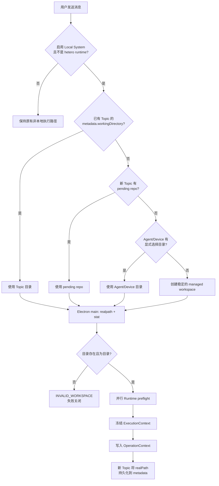
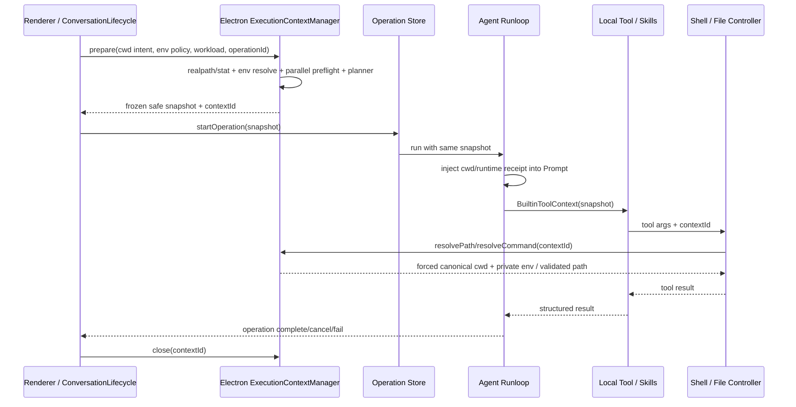
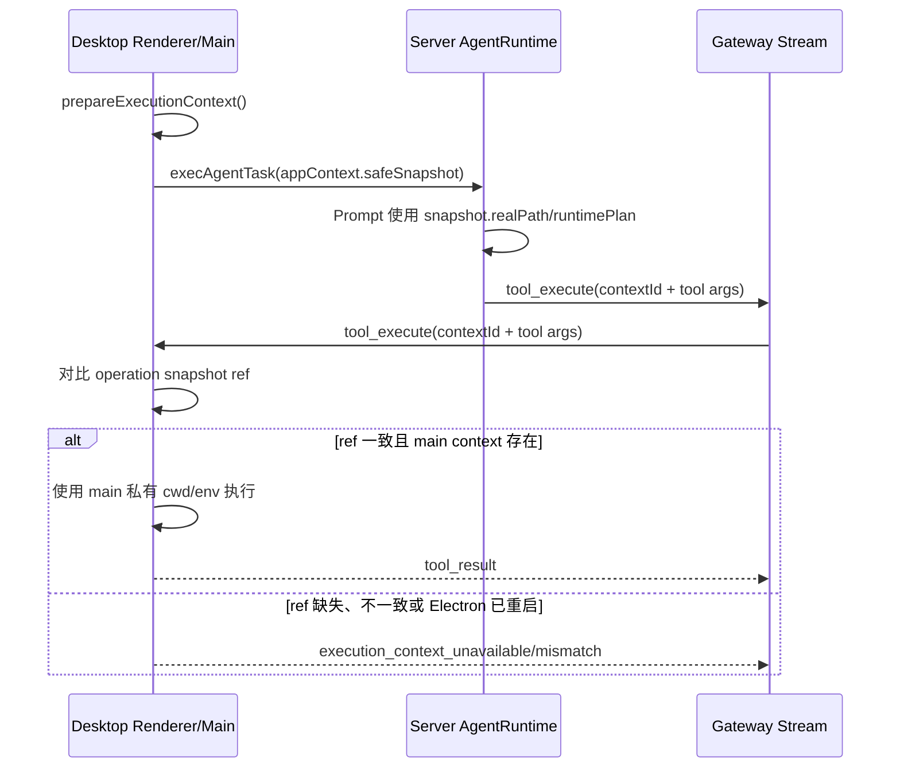

# Electron 本地执行上下文

本文描述 Masterino Electron 本地工具执行的单一上下文模型。目标不是把
`workingDirectory?: string` 继续向各层透传，而是在每个本地 operation 开始时解析一次，并让
Prompt、文件工具、Shell、Skills、Gateway callback 和诊断结果共同引用同一份快照。

## 核心模型

`ExecutionContext` 将四个原本容易混淆的概念分开：

| 概念                      | 作用                                      | 当前实现                                                          |
| ------------------------- | ----------------------------------------- | ----------------------------------------------------------------- |
| `workspace.realPath`      | 所有相对路径和命令的执行起点              | canonical `realpath`，目录身份在每次执行前复核                    |
| `workspace.writableRoots` | 文件访问的允许边界                        | 主进程校验；允许 root 内绝对路径，拒绝 `..`/绝对路径/symlink 越界 |
| `environment`             | Shell 环境的来源与过滤策略                | 完整值只存 Electron main；renderer/server 只看到 key 级 receipt   |
| `runtimePlan`             | Runtime 与 Package Manager 的选择及可用性 | turn 开始时并行 preflight，随后冻结                               |

公开快照只包含安全信息：

```text
contextId + version
canonical workspace + writable roots
runtime/package-manager choice + version/status
environment policy receipt (没有环境变量值)
```

完整环境变量、可执行文件绝对路径和检测细节只存在 Electron main 的内存 Map 中。

## Topic 目录解析



没有选择目录时仍然是本地 agent runtime；区别只是 Electron main 为 Topic/Agent 分配
`userData/execution-workspaces/<stable-hash>`，不会再静默使用 Electron 的 `process.cwd()`、
Home 或 Desktop。

## 一次本地 operation 的生命周期



调用方传给 `runCommand` 的 `cwd` 和 `env` 不具有权威性。只要附带 context reference，
主进程就会覆盖它们。`lh` 特殊路由与 Skills 命令也经过同一解析；不会绕过 frozen cwd/env。
人工批准、提交交互、跳过和“拒绝后继续”都会创建新的 continuation operation，并在继续
runloop 前重新 prepare 一次；同一 continuation 内仍只使用这一份快照，结束后 close。
若 continuation 交给 Gateway 子 operation，context 所有权也一并转交，不能在父 action 返回时
提前 close；由 Gateway cancel/session-complete 钩子结束其生命周期。

## Gateway 两阶段关系

目前的 Gateway 已具备两阶段协议所需的安全边界：renderer 先在本机 prepare，服务器只保存
公开快照，并在每次 client tool callback 中回传 opaque reference。



服务器永远不会收到本机环境变量值。Electron 重启后内存 context 消失，旧 Gateway
operation 即使重连也会失败关闭，不能退回 `process.cwd()`。后续若要支持副作用恢复，应增加
durable journal/artifact receipt；不能把“重建环境并猜测是否执行过”混进本模块。

## Runtime 与 Provisioner

Preflight 并行检测 Node、Bun、Python 及 npm/pnpm/yarn/bun/uv/pip。Planner 顺序为：

1. workload 明确声明；
2. 项目配置（`package.json` engines/packageManager、`bunfig.toml`、`pyproject.toml`）；
3. lockfile；
4. 明确的 Masterino-owned + bun-compatible 声明；
5. 默认值（未知 JavaScript 任务为 Node）。

Runtime 和 Package Manager 独立选择。项目声明 pnpm 时不会因为 npm 可用而自动换 npm；Node
缺失时也不会因为 Bun 可用而把 Bun 当作 Node。

本模块是 detect-only，不执行网络下载或软件安装。仓库当前没有可复用的本地 Provisioner；
自动安装应作为后续独立模块，输入冻结的 `RuntimePlan` 和用户授权，输出安装 receipt，再创建新
context 重新 preflight。Provisioner 不应修改已冻结 context，也不应静默更换用户项目的
Package Manager。

## 失败语义

以下错误均在 Electron main 权威产生：

| code                       | 含义                                                |
| -------------------------- | --------------------------------------------------- |
| `INVALID_WORKSPACE`        | 选择值不是绝对路径、目录不存在或 writable root 无效 |
| `WORKSPACE_UNAVAILABLE`    | turn 中途目录消失或 inode/device 身份变化           |
| `PATH_OUTSIDE_WORKSPACE`   | 相对或绝对路径经规范化/symlink 解析后逃出允许 roots |
| `CONTEXT_NOT_FOUND`        | context 已关闭、Electron 已重启或引用不存在         |
| `CONTEXT_VERSION_MISMATCH` | renderer/server 与 main 的协议版本不一致            |

这些错误表示本地执行没有开始。它们不能包装成 shell 成功，也不能触发生命周期的静默 fallback。

## 测试与质量门槛

自动化 Electron E2E 使用真实 Electron main/preload/renderer，并直接导入生产
`ExecutionContextManager`。测试实际启动子进程，覆盖：

- Topic 已选择目录时，UI 值、snapshot 值和子进程 `cwd` 一致；
- Topic 未选择目录时，managed workspace 稳定且不是 `process.cwd()`；
- PATH/env policy 被冻结，排除的 secret 不进入子进程或公开 receipt；
- Node 缺失而 Bun 存在时不发生替代，Package Manager 仍按项目声明；
- 缺失目录、symlink 越界、Electron 重启后的 stale context 全部失败关闭；

聚焦 Vitest 集成测试覆盖 renderer 的 Topic/Agent/Device 优先级、Operation 快照、Prompt、
direct/Gateway callback、文件/Shell、Skills 资源准备和 `lh` 特殊路由的 reference 传递与
fail-closed 行为。它们与 Electron E2E 是两组独立证据，不能把 deterministic harness 描述成
完整产品 UI 链路。

此外，用开发版真实 App 做产品 smoke：通过 Topic 目录选择器选择目录后发起对话并批准
`pwd`，输出与 UI 目录的 canonical path 一致；清空目录后再次执行，输出落在
`userData/execution-workspaces/<stable-hash>`，证明“未选目录”仍走本地 runtime，而不是
Electron `process.cwd()`。该 smoke 用于建立 UI 与代码路径的对应关系，不替代自动回归。

本变更的评分维度和证据记录在 PR 描述中。任何维度低于 8/10 都必须先补测试或返工，不得合并。
