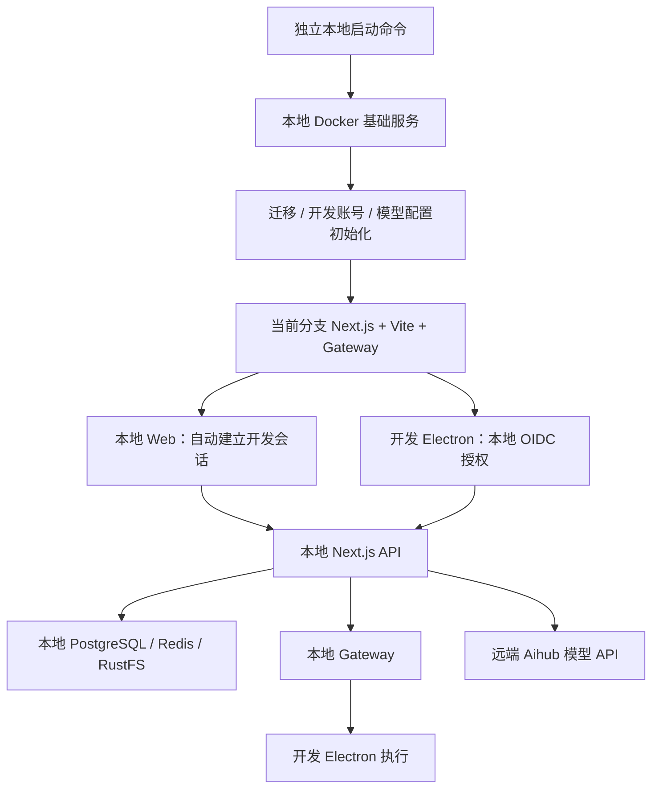

# Masterino 本地开发与内测环境实施方案

日期：2026-09-05  
状态：待评审，未实施  
依据：当前 `feat/workspace-runtime` 分支；当前已有提交 `b4d8466a`

## 1. 目标与改动边界

建立可重复启动的本地完整业务联调环境，以及能验收真实发布制品的内测流程。主要建设开发环境，补强内测版本追踪、客户端环境绑定和验收；线上沿用现有部署方式。

本地通过后进入内测；内测通过后才按现有流程发布。不能把“本地客户端连接已部署的测试后端”计作“当前分支前后端完整联调”。

### 线上保护范围

- 本项目不迁移或重建线上数据库、缓存、存储、Gateway、Ingress、域名和登录回调。
- 不改生产 Secret、正式 App 默认后端 / Gateway、生产更新渠道或正式发布触发条件。
- 默认不修改 `k8s/base`、`k8s/overlays/production*`、生产部署脚本和正式发布 workflow。内测差异写入 test overlay 或内测专用工具。
- 共用代码确需改动时，限于开发入口接入、已有启动能力复用及测试验证；不重写通用鉴权、执行目标或工作空间模型。
- 新增开发功能必须默认关闭；生产模式下即使误配开发开关也不能签发开发会话。
- 实施中只要发现必须改变生产行为，先列明原因和最小影响范围，作为独立问题评审，不混进本地环境搭建。

## 2. 已核对的现状

| 现有能力 | 可复用内容 | 当前缺口 |
| --- | --- | --- |
| `scripts/devStartupSequence.mts` | Next.js + Vite 启动、可选开发反向代理与 HMR 升级连接 | 缺少独立配置入口、依赖生命周期及启动诊断 |
| `docker-compose/dev/docker-compose.yml` | ParadeDB、Redis、RustFS、SearXNG 定义 | 固定容器名、部分浮动镜像版本、初始化脚本输出凭据；现有 `dev:docker` 未启动 rustfs-init |
| `docker-compose/deploy/docker-compose.hot.yml` | 已有热更新经验 | 复用测试数据库、缓存等依赖，不适合作为隔离本地环境的默认方案 |
| Better Auth | 数据库会话、Redis 存储、账号初始化 hook | 模拟用户入口不能统一覆盖前端、上传和桌面授权；需要真正的本地开发会话 |
| OIDC + Gateway | 桌面授权、Token 刷新、本地 Gateway 源码及签名验证 | 需要本地签发者、密钥与 Gateway 全链路联调 |
| Electron Gateway 配置 | `envUrl` 优先于保存地址，之后才用生产默认值 | 本地开发启动没有成套指定环境时可能连接错误的 Gateway |
| `.github/workflows/build-desktop-test.yml` | 已显式指定内测 Gateway，有测试数据目录隔离 | 当前主要构建 Windows，路径触发未覆盖全部共用前端；版本和更新来源需作为验收信息核查 |
| test Kubernetes overlay / `deploy.sh --env test` | 现有内测部署、Gateway、memory worker 与迁移路径 | 需要补齐版本清单、只读环境检查和稳定的验收报告 |

以上是代码及本地配置调查，不代表已经审计运行中的测试 / 生产集群。已知本机开发 Electron 曾连接测试后端，却保存生产域名 Gateway；不能据此推断 CI 生成的测试安装包也存在同样配置错误。

## 3. 本地运行架构



应用代码在宿主机运行，不为每次修改构建应用 Docker 镜像。三项基础服务使用 Docker；Gateway 首先验证能否直接运行仓库内的 Go 源码并限制本地访问。若该运行方式不能满足监听范围或平台条件，再选择已有、版本匹配的镜像并仅发布回环端口。该选择在第 0 阶段完成，不留给每位开发者自行排障。

### 拟定端口与资源

端口是方案默认值，并非已经启动的服务。配置入口允许整体覆盖，所有派生 URL 跟随更新。

| 组件 | 默认位置 / 端口 | 用途 |
| --- | --- | --- |
| Web 统一入口 | `http://localhost:3010` | 浏览器、Cookie、OIDC issuer 使用同一 origin |
| Next.js 内部服务 | `localhost:3011` | 复用现有开发反向代理模式，承载当前分支 API |
| Vite | `localhost:9876` | SPA 源码与 HMR |
| Electron renderer | `localhost:5173` | 桌面专用 renderer；主进程按现有 dev 方式重启 |
| PostgreSQL | `127.0.0.1:15432` | ParadeDB，启用 vector / pg_search |
| Redis | `127.0.0.1:16379` | 缓存、会话、记忆队列 |
| RustFS | `127.0.0.1:19000`，控制台 `19001` | 文件数据与本地对象存储 |
| Gateway | `localhost:8788` | 设备连接与执行转发 |
| SearXNG（可选） | `127.0.0.1:18180` | 网络搜索，与记忆检索不同 |

保持 `localhost` 作为对外应用 origin，避免 Cookie / OIDC 在 localhost 与 127.0.0.1 之间来回切换。依赖内部连接地址可以使用回环 IP。开发 HTTP 例外只允许本地回环，不扩大通用可信域名范围。

本机 M4 / 16 GB 可作为首个验收目标；Docker 先分配约 4–6 GB，再按真实峰值调整。这是初始配置建议，不是已测得的资源保证。启动时检查剩余内存与磁盘，记录编译和聊天 / 文件处理时的占用。先支持 macOS 和 Linux；脚本主体使用 TypeScript，避免把核心逻辑写成仅 macOS 可运行的 Shell，Windows 支持另做实测后声明。

## 4. 配置与启动工具

### 文件设计（拟新增）

```text
scripts/local-dev/
  cli.mts                  # setup / start / stop / status / doctor
  config.mts               # 唯一配置入口、派生 URL、校验
  infrastructure.mts       # Docker 生命周期、所属实例与健康状态
  bootstrap.mts            # 迁移、开发用户、初始模型配置
  processes.mts            # Next / Vite / Electron / Gateway 启停
  diagnostics.mts          # 地址、版本、请求与验收记录

docker-compose/local/
  compose.yml              # 独立的本地基础服务，不继承部署 Compose
  env.example              # 无凭据模板

.local-dev/                # 加入 gitignore，权限限制
  config.env               # 本机独立配置、开发 Key
  state.json               # 实例 ID、所属进程、端口、版本
  secrets/                 # 本地 auth / vault / OIDC / Gateway 密钥
  logs/                    # 分服务日志，不记录凭据
  reports/                 # 验收报告
```

不要让脚本把大量初始化逻辑塞进现有通用 dev 启动文件。优先由独立启动器传入一套显式配置；必要时给现有启动器加配置文件入口。禁止未声明变量从历史 `.env` 或旧测试代理配置中悄悄补齐。既有 dev 模式保留原有行为，新模式才使用严格配置。

### 面向同事的拟定命令

```bash
pnpm dev:local:setup       # 检查工具、初始化配置、启动依赖、迁移与 seed
pnpm dev:local            # 启动本地 Web / API / Gateway
pnpm dev:local:desktop    # 在同一环境启动独立开发 Electron
pnpm dev:local:doctor     # 地址、版本、依赖、身份、模型连通性诊断
pnpm dev:local:stop       # 仅停止本工具创建的进程和容器，保留数据
```

这些命令尚未实现。首次由开发者提供专用 Aihub Key 和允许使用的模型；后续启动不重复覆盖配置。诊断默认只读，消耗模型额度的检查使用显式选项。Web 与 Electron 可以分别启动，但必须指向同一个配置实例。

启动规则：

1. 检查 Node / pnpm / Docker，以及选定 Gateway 运行方式所需工具。镜像验证 ARM64 支持并固定版本或 digest。
2. 检查端口占用；报告进程和用途，不自动杀死已有 App、代理或其他工作目录服务。
3. 生成实例 ID、独立 Compose project、命名卷、密钥与本地环境标识。
4. 启动基础服务，等待真实健康检查；执行存储桶初始化，禁止打印存储凭据。
5. 确认数据库对应本工具的 Docker 实例及端口映射后迁移；数据库地址仅是 localhost 不足以证明安全，因为 localhost 也可能是远端隧道。
6. 幂等初始化开发用户和配置，已有聊天、密钥和用户调整默认保留。
7. 启动后端、Vite、Gateway，完成身份和服务检查后再打开页面。
8. 展示环境摘要：分支、SHA、是否有未提交修改、后端 origin、Gateway、数据库实例、客户端构建类型、日志位置。

`stop` 不删除卷。数据重置是另一个显式、需指定实例的操作；禁止重用现有带 `down -v` / 删除数据目录的命令作为默认重启方式。异常退出后的重复启动必须可恢复，并且不能停止其他任务的服务。

## 5. 开发登录：免企业微信，保留真实鉴权链路

### 推荐实现

采用独立开发账号 + Better Auth 本地会话。体验上启动后直接进入首页；业务 API 仍按现有会话识别用户。现有 `ENABLE_MOCK_DEV_USER` 不作为这套环境的主鉴权方式，避免接口拿到用户 ID 而桌面 / 上传 / Gateway 没有身份。

- bootstrap 复用现有用户初始化服务和 Better Auth 能力，创建固定开发账号及必要数据库记录，使用本地生成的凭据；不伪造企业微信绑定。
- 增加一个仅本地开发模式可用的会话建立入口。优先复用当前安装版本的 Better Auth 登录与 Cookie 签发 API，不手写 Cookie、不直接拼接会话表记录。
- 本地启动器提供短时、单次开发授权凭据；浏览器自动兑换成本地会话。凭据不放进普通 URL 查询参数、日志或可提交配置，不允许调用者任意指定 userId。
- 入口须同时满足 development 模式、显式本地环境开关与对应本地实例校验。非开发模式固定拒绝，即使开关被错误设置。
- 不全局信任 Origin、不开放任意 CORS、不让开发账号自动拥有企业管理员权限。
- 不在每次 get-session 返回空时自动重新登录。启动器负责进入开发账号；用户主动退出后应可验证退出状态，再通过显式开发入口重新进入。

### Electron 与 Gateway

Electron 保留现有授权码 / Token 刷新流程，只把认证服务器换成本地。企业微信不参与本地登录；本地 Better Auth 会话完成 OIDC 所需身份，随后正常发放本地 Token。

- 本地 issuer、APP_URL、OIDC callback 与 Token 请求 origin 一致。
- Gateway 使用从本地 JWKS 私钥派生的公钥；服务间 token 单独本地生成。
- Web 会话用户、OIDC subject、Gateway 设备归属必须映射为同一个本地用户。
- 验证 Token 刷新、过期、重连和 issuer 校验；不直接把静态假 Token 塞入 Electron。
- 浏览器 Cookie 与桌面 Token 分开处理，不假设 Web 登录完成就等于 Electron 已授权。
- 若需改现有回调接入点，改动仅在开发模式启用，保留真实 test / production 登录链路的行为测试。

这部分是关键工程工作，不能归类为“只写启动脚本”。阶段 0 必须先证明当前 Better Auth / OIDC 接口能够形成该闭环，再固定 API 形态。

## 6. 数据、文件、模型与记忆

### 数据与文件

- 独立本地 ParadeDB 实例；先检查扩展，再执行仓库真实迁移，不能以临时建表脚本代替。
- 新库初始化和旧本地库升级分别测试。seed 按稳定开发用户标识幂等运行，不覆盖用户现有目录、话题与模型设置。
- RustFS 创建本地 bucket，配置服务端 endpoint 与本地可达下载地址。
- 浏览器上传继续走同源 `/api/upload/s3-proxy`，不改成直接访问 Docker 服务名。验证上传、下载、图片预览和 Electron 附件。
- 如果远端视觉模型无法访问本地图片 URL，使用现有服务端图片转 base64 能力；不要把本地存储临时暴露到公网。

### Aihub 与记忆

- 专用开发 Key 仅供本地后端使用，通过现有用户凭据存储及 provider / model 配置接入。
- 本地账号使用明确配置的模型能力，不通过伪造企业账号状态绕过现有 Aihub 托管用户规则。
- 聊天和 embedding 分别校验；默认配置和数据库维度相容后才开启自动记忆。`text-embedding-3-large` / 2048 维是当前代码中的默认假设，实际必须以开发 Key 可调用能力为准，不静默换模型。
- 记忆检索使用本地 PostgreSQL 的向量 / 全文能力；自动记忆启用 Redis 队列和本地 worker，沿用现有实现，不额外引入向量数据库。
- 验收必须包含产生记忆、入队 / 执行、落库、下一话题召回及失败可见性，不以普通聊天成功代替。
- Aihub 用户同步、托管 Token、权限及配额集成仍在内测验证。主应用不能直接访问 Aihub 数据库。

### 首期未完全本地化的能力

SearXNG 可作为可选 profile。市场服务、Onlyboxes 云沙箱、企业身份同步不纳入首期完整复制，但必须逐项检查是否存在启动硬依赖：例如 Market 的 URL 缺失曾影响页面启动，不能只留空变量就宣布“已禁用”。

优先使用现有 capability / 开关屏蔽未配置功能；没有现成能力时增加最小、默认行为不变的开发配置支持。页面要有明确不可用状态，相关自动请求不应持续报错。禁止静默落到测试或生产服务。只有模型 API 是默认远端业务依赖；安装依赖、更新检查、市场请求等额外网络行为也要盘点并在开发模式中明确处理。

## 7. Electron 三环境隔离

| 模式 | 数据目录 | 后端与 Gateway | 更新策略 |
| --- | --- | --- | --- |
| 本地开发 | 新的本地实例专用目录 | 由本地配置成套注入 | 不检查正式更新 |
| 内测 App | 沿用隔离的 test 目录 | 明确内测后端 + 内测 Gateway | 核查测试渠道，避免测试中自动换成未验收产物 |
| 正式 App | 沿用现有目录 | 保留生产默认行为 | 保留正式更新方式 |

不覆盖之前 `masterino-desktop-dev` 中连接测试服务器的登录信息，也不自动将已有保存地址批量迁移。新增本地开发实例目录，连接内测的源代码客户端如需保留，明确标成“内测联调”而不是“本地完整联调”。

优先复用现有 Gateway 环境变量优先级，不修改生产 fallback。后端与 Gateway 的成套配置检查仅加在开发 / 内测启动路径。验证测试 CI 是否实际将变量嵌入产物，不能只看 workflow 中存在变量。

## 8. 内测环境的补强

### 8.1 沿用部署，增加候选版本记录

继续使用现有 test overlay、测试域名、企业微信和对象存储。现有 `deploy.sh --env test` 的部署和迁移流程作为基础，不建设第二套部署系统。

新增候选清单，至少记录：

- 源代码完整 SHA，以及构建的是 PR head 还是合并验证提交。
- 服务端镜像 digest；共用镜像的 memory worker 是否同步更新。
- 测试 App 平台、版本、构建 SHA、后端、Gateway、更新渠道。
- 数据库迁移版本；未变更的 Gateway / 市场 / 沙箱等依赖记录其当前版本。
- 部署时间、验收结果与已知未覆盖项目。

不依赖 `latest` 证明版本一致。新增内测部署操作的默认步骤是只读 plan / preflight；执行部署仍沿用现有显式发布授权。开发者改代码只热更新，不自动触发镜像发布或自动覆盖共享内测集群。

### 8.2 内测启动前检查

新增内测专用检查工具，校验 namespace / 集群 context、APP_URL、Gateway、数据库与对象存储归属，禁止出现 localhost 开发回调或开发免登录开关。输出配置键与非敏感地址，不打印 Secret。

共享 Aihub 或 Onlyboxes 等现存远端依赖需要明确列为允许的共享依赖，不把“域名不是测试域名”简单等同于错误。真正需要隔离的是用户数据、会话、应用密钥、设备归属与执行目标。

生产默认地址应保留；仅对错误的内测构建参数或 test overlay 做定向修正。

### 8.3 测试 App 构建覆盖

现有测试 workflow 已指定内测 Gateway，优先补验证，不重复重构。

检查路径触发是否覆盖 renderer 使用的 `src/`、共享 packages、locales、构建配置。当前 workflow 主要构建 Windows；本机 macOS 测试需有可重复的测试构建入口或 CI 制品，明确源码 dev App 与打包测试 App 的区别。

当前测试构建版本与更新渠道也需要核查，防止旧版本编号或自动更新使测试期间切换到其他制品。相关调整仅落到测试 flavor，不改正式 updater 行为。

### 8.4 内测验收重点

- 真实企业微信 Web 登录、Cookie 会话、退出与过期。
- Electron 授权、Token 刷新、绑定内测 Gateway、跨端可见性与重连。
- 原有数据迁移后的话题、项目、目录及文件兼容。
- 候选后端、memory worker 与候选客户端组成的完整业务链路。
- 本地首期未覆盖的 Aihub 企业同步、配额 / 权限、市场、搜索与云沙箱。
- 在明确支持范围内验证旧客户端 + 新后端、新客户端 + 旧后端；不默认所有历史版本均兼容。

## 9. 实施阶段、产出与退出条件

| 阶段 | 工作 | 通过条件 |
| --- | --- | --- |
| 0：关键链路验证 | 确定本地会话签发方式、OIDC / Gateway 运行方式、Market 硬依赖和 ARM64 镜像 | 最小 Web + Electron 使用同一本地身份；没有远端测试会话依赖；形成接口与配置清单 |
| 1：基础环境 | 独立 Compose、配置加载、初始化、启停与 doctor | 新电脑按文档可拉起依赖；重复启动不破坏数据；端口冲突、配置误指远端能提前发现 |
| 2：身份与桌面闭环 | 开发登录、独立 Electron 目录、本地 Token 与 Gateway | 无企业微信可进入首页；Web 经 Gateway 使 Electron 执行并返回结果；刷新与重连通过 |
| 3：业务完整联调 | 项目 / scratch、文件、模型、记忆及服务端热更新 | 当前分支后端修改被真实调用；涉及的工作空间流程逐项通过；日志可定位请求 |
| 4：内测补强 | 候选清单、test preflight、测试 App 构建校验、验收报告 | 本地通过的确切代码版本部署内测后完成真实登录、多端和升级验收 |
| 5：交付 | 团队文档、故障处理、停止 / 恢复步骤及验证记录 | 同事从新配置和空数据卷复现；记录未覆盖项；按原有生产流程单独决定发布 |

建议按“本地基础工具”“开发身份及桌面接入”“内测检查与验收”拆分提交或 PR，确保每一部分可单独审查。新建工作分支遵循 `codex/` 前缀，但实际开始实现时再确定分支和基线，当前方案阶段不切分支。

工作量判断：整体为中等工程量。Compose 和命令包装较直接；主要复杂度在本地真实身份 / OIDC / Gateway 一致性、未配置市场时的启动行为，以及内测制品可追踪性。阶段 0 完成后再给准确工期，不承诺“只加几个脚本就完成”。

## 10. 验证矩阵

| 类别 | 最少验证内容 |
| --- | --- |
| 环境隔离 | 本地启动拒绝误指远端 DB；回环隧道不被误认成本工具数据库；stop 只处理所属进程；test / production 模式不能获得开发会话 |
| 身份一致性 | Web 用户、OIDC subject、Gateway 设备归属一致；无 Token / 错误 issuer / 过期凭据被拒绝；logout 不立即自动登录 |
| 目录与项目 | 新目录首次聊天项目展开；顶部新话题可编辑直到首条消息后锁定；项目 + / 最近 + 保持各自语义；scratch 无目录 |
| Web / Electron | Web 不出现不可用的本机文件夹选择入口；设备选项与当前客户端能力一致；已有发现的问题另列最小修复，不借环境搭建大改 UI |
| 执行 | Web → 本地后端 → 本地 Gateway → Electron，使用临时目录执行可核对命令；断网、恢复与切换话题不串设备 |
| 文件与记忆 | 同源上传 / 下载；模型能处理本地图片；记忆生成、落库、召回；队列错误可见 |
| 后端代码覆盖 | 更改本地接口后返回新版本标识或观察预期行为变化；确认当前进程加载 `apps/server` / `packages` 本地源码 |
| 内测产物 | 构建 SHA / digest 一致；memory worker 版本匹配；真实登录、升级数据和桌面安装包完成验收 |
| 生产行为保护 | 受影响共用代码的针对性测试；正式构建开发入口不可用；生产 manifest 渲染结果与改动前无非预期差异 |

测试以有意义的配置、鉴权、进程归属及业务边界为主，不写大量仅复述实现的测试。不运行全量耗时测试替代针对性验证。手工结果、自动测试、构建检查分别记录，不混称“全部测试通过”。

## 11. 交付物与验收结论格式

最终交付：可运行的本地命令、无凭据模板、固定基础镜像版本、初始化与恢复文档、内测只读检查工具、候选版本清单，以及本分支的本地 / 内测验收报告。

每份报告写清：环境、Git SHA 与工作区状态、实际 API / Gateway / 数据实例、客户端类型、通过步骤、失败项、未覆盖项。报告及 doctor 不收集或输出用户密钥、会话 Cookie 或 Token。

本轮仅新增这份方案文档。没有启动新环境、修改生产配置、构建 / 部署镜像、修改业务鉴权代码或提交新 commit。
