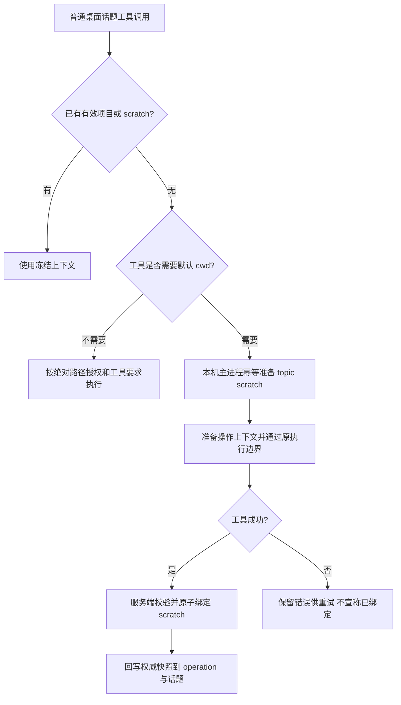

# Workspace PR #116：修复方案与验收记录

日期：2026-09-06。状态：A/B/C 修复及真实 UI 发现的接线问题已分批提交，本地 Web / Electron 可执行主链路验收完成；缺少真实前置的扩展场景明确记录，尚未合并或部署。

## 结论与依据

按用户确认，一次完成 A（Web 平台边界、桌面 scratch、旧话题兼容）、B（设置草稿）、C（skill 完整链路与扫描反馈）。必须先完成本地 Web 和 Electron 的真实 UI 验收，再更新 PR、合并并部署到 masterino-test；之后重复 Web 和 Electron 验收。

本轮静态核对了用户列出的代码、[PR #116](https://github.com/chaaak6/Masterino/pull/116)、[总契约 AC-W07/W08/W10](https://github.com/mate-matt/masterino-personal-workspace/blob/docs/workspace-runtime-v2/docs/specs/workspace-runtime/02-integrated-product-spec.zh-CN.md) 和 [L4 skill 契约](https://github.com/mate-matt/masterino-personal-workspace/blob/docs/workspace-runtime-v2/docs/specs/workspace-runtime/L4-skills/spec.md)。代码支持这些断点的判断；未重新执行用户提供的探针，不把已有 CI 通过当作这些场景已覆盖。

本轮的 Web 产品边界以用户最新要求为准：不创建、选择或改绑设备项目目录，保留云端沙箱、网关机器及跨端话题继续执行能力。本地开发 Web、内测 Web、线上 Web 使用同一平台规则，不新增按域名或 NODE_ENV 隐藏的补丁。

## 1. Web 显示与操作边界

| 能力                                       | Web                                                                   | Electron                           |
| ------------------------------------------ | --------------------------------------------------------------------- | ---------------------------------- |
| 项目分组、项目 +、项目行 +                 | 隐藏                                                                  | 保持现有行为                       |
| 最近 / 话题列表                            | 包含有权限的全部话题，项目话题也能找到；按时间或平铺展示              | 保持项目与最近的现有分类           |
| 按项目分组菜单                             | 隐藏；旧 byProject 偏好仅在 Web 显示时回落，不写回共享偏好            | 保留                               |
| 新话题执行目标                             | 云端沙箱 / 网关机器；纯聊天无执行目标状态仍可存在                     | 本机 / 云端沙箱 / 其他网关保持现状 |
| 选择项目、目录路径输入、系统文件夹选择     | 不挂载，不发目录列表或探测请求                                        | 保留，包括顶部新话题首发前可编辑   |
| 已绑定项目话题                             | 仍可打开、查看和经其绑定设备执行；不提供改绑入口                      | 保持锁定目录和设备                 |
| 上传、附件、结果下载                       | 保留现有浏览器能力                                                    | 保留                               |
| 设备列表、Gateway 状态                     | 保留                                                                  | 保留                               |
| 设备项目 env / envFiles / 项目技能管理入口 | 本轮 Web 隐藏入口并限制对应页面编辑；不关闭通用设备管理或用户技能管理 | 保留                               |
| 原有云端仓库配置                           | 保留其原有沙箱流程，与设备目录选择区分                                | 保留                               |

“隐藏项目”不等于删除工作区记录、过滤掉项目话题或关闭所有 device API。尤其不能直接复用只包含 scratch/unbound 的 `navigation.recent`，否则用户在 Electron 创建的话题会从 Web 消失。

### 根因与实施位置

1. `src/store/chat/slices/topic/action.ts` 的 `localNewTopicIntent()` 无条件生成 local；顶部入口也无条件调用项目继承。先把新建意图按平台分开，再统一用于顶部、最近、快捷键及其他新建入口。Web 草稿不得携带 desktop 的 local、workspaceId、legacyWorkingDirectory。
2. Web 默认目标沿用 Web 的合法配置；若只剩非法 local 值，不猜测用户选择了云端或其他设备。允许普通纯聊天，工具执行前要求合法目标。已有 local 快照按绑定 deviceId 投影为网关机器，离线显示不可用，不能改写持久快照或降级到其他机器。
3. `WorkspaceControls.tsx` 目前只拦截 Web 的非 device target；local/device 分支仍能挂载 WorkspacePicker。改为独立能力判断，并在 picker/绑定 action 做边界防守，不能只用 CSS 隐藏。
4. 侧栏的两个 TopicList 入口及分组菜单统一消费 Web 话题视图。`byProject` 的兼容回落仅影响当前 Web 展示，不修改 Agent 的全局配置，不改变 Electron 的 `classifyTopicPlacement`。
5. 建议一个小型、显式的平台能力模块描述“能否选本地目录、能否管理项目、能否选执行设备”，被上述入口共用；不扩展成新的通用权限框架。服务端继续保留已有 ownership、target 和 bind-once 校验。

### 异构 Agent 的恢复路径

- Electron 未首发、未绑定草稿：恢复动作实际打开目录选择流程，并写入本次草稿；不能只向未挂载 picker 发 focus。
- 已绑定 scratch：动作是“新建项目话题”，选择目录后创建新话题并引用旧话题；原 scratch、CLI session 和快照不变。
- Web 未绑定的设备异构话题：不能一边隐藏 picker，一边保留“选择工作空间”的无效按钮。提供去桌面端创建项目话题的明确路径，再在 Web 继续；桌面深链应使用已有受支持入口，若无该能力，则给设备/客户端指引，不能伪造一个可操作按钮。
- Web 已有合法项目绑定的异构话题：保留设备执行与恢复，不因隐藏目录选择而误禁用。

## 2. 逐项处理顺序

| 问题                              | 判断与优先级                                           | 批次 |
| --------------------------------- | ------------------------------------------------------ | ---- |
| Web 显示本机、目录与项目入口      | 确认。新建意图和 UI 边界同时泄漏，可造成首发失败       | A    |
| 无目录桌面工具调用在 IPC 前失败   | 确认 P1。影响普通最近话题，优先修                      | A    |
| 旧项目捕获 snapshot 后丢 cwd      | 确认历史数据 P2；涉及既有会话回归，建议与 scratch 同批 | A    |
| 异构“选择工作空间”无效            | 确认 P2。与 Web 屏蔽及 scratch 绑定状态密切相关        | A    |
| 折叠设置丢草稿                    | 确认 P2。修复独立，不必等待 skill 执行实现             | B    |
| 项目 skill scan 未填充            | 确认 P1。设置页扫描不是 operation 扫描                 | C    |
| desktop skill 缺 deviceFileAccess | 确认 P1。发现成功后仍会在激活/引用处失败               | C    |
| server device skill ZIP 未准备    | 确认 P1。已有项目 cwd 不能替代 skill 包目录            | C    |
| skill cwd 改变 .env 根目录        | 确认 P2。与设备 skill 执行上下文一起修                 | C    |
| 项目 skill 扫描失败当空列表       | 确认 P2。hook 丢弃 error，设置页无法区分错误与空       | C    |

## 3. A 批：工具上下文与历史兼容

### Scratch 懒创建

不能只删除 `LocalSystemExecutor.workspaceRequired()`：Electron 的 `prepareToolCallExecution` 仍需有效执行上下文、路径授权和 trace。

应提取/复用服务端已有的“是否需要默认 cwd”判断，在 client runtime 工具调用之前建立同等准备步骤：

- 纯聊天不准备目录、不创建 workspace 行。
- 明确绝对路径的结构化只读，按最新一手用户消息的 operation consent 判断；不为了读取先创建 scratch。附件、引用和代码块不产生自动授权。
- `pwd`、相对路径等需要默认 cwd 的调用才准备 scratch；命令输出查询、终止等应按其已有 operation/进程上下文判断，不能笼统要求目录。
- 保持普通 Electron client runtime，通过本机 IPC 调主进程；不能为了复用代码强制走远端 Gateway，也不能直接落到进程默认 cwd。
- 沿用 `ensureScratchWorkspace` 与服务端成功后绑定规则。准备按 device/topic 幂等，同 operation 并行工具共享准备结果；绑定冲突时以服务端结果为准，明确处理冲突，不能静默重跑到新项目。
- 成功绑定后把权威上下文写回 operation，后续工具、retry、resume 都复用同一身份。失败后的临时目录复用/清理遵循现有策略，不把物理目录存在误当作正式绑定。

### 旧话题迁移

`bindingStore.writeTarget()` 保留了 legacy 路径证据，但 snapshot 可能没有 workspaceId；`aiAgent.resolveFrozenExecutionContextInput()` 又因 snapshot 存在停止传 legacy 数据。两侧需要统一规则，不能只修客户端。

- 以“有没有可解析的正式 workspace”为条件，不能以“有没有 snapshot”为条件丢弃有效历史证据。
- 设备、规范化路径及用户归属一致时，复用/创建正式 workspace，在锁和 CAS 下补齐快照；保留首次执行目标。
- 对已经产生半迁移快照的数据也能幂等修复，不能只覆盖首次升级。
- 无法在线验证、路径冲突或设备不匹配时保留证据并返回可恢复错误，不能转成 scratch 或别的机器。
- 采用按话题访问时的修复，不先做全表猜测性批量改写。

## 4. B 批：折叠设置保留草稿

`WorkspaceExtensions` 折叠时卸载子编辑器，导致其本地 state 被销毁。优先采用首次展开后保持挂载、折叠只控制可见性的方式；不把 env 明文草稿存入持久化全局 store/localStorage。切换 workspace 时按 workspaceId 区分实例，避免把 A 的草稿带到 B。

验收 env、envFiles 和 skill policy：输入后折叠再展开仍保留；保存/取消行为正常；页面关闭不新增秘密持久化。

## 5. C 批：Skill 完整链路

按以下顺序实现和验收，避免把“provider 存在”当作功能完成：

1. **扫描 → 冻结。** 在 operation registry 冻结前，按 workspace 身份、deviceId 和 skill policy 真实扫描。本机走已有 workspace IPC，远端走已绑定设备 RPC；设置页不是前置条件。明确 scan 缓存的唯一来源、时间及错误状态。新 operation 可重新获取；同一 operation 的 retry/resume 继续用已冻结的技能集合，不能重选同名赢家。
2. **激活 → 引用文件。** 给 desktop `SkillsExecutionRuntime` 接入 deviceFileAccess 的 list/read 实现，复用现有主进程边界和 operation 权限。只读取获准技能目录及引用，检查 realpath、越界和符号链接；不得绕过路径校验直接给 renderer 任意文件访问。
3. **用户 ZIP → 设备准备。** 为 server device 路线接入 skillDirectoryResolver：解析已激活且获授权的技能包，传输并准备到选定设备上的缓存目录，再返回规范路径。复用已有包准备能力；校验解压路径、缓存版本、设备身份及并发。未准备成功不执行脚本，不回落服务器本机或其他设备。
4. **脚本 cwd 与项目环境分离。** `cwd=skillDir`，`workspaceRootPath=原项目根目录`；`SKILL_DIR` 指向技能目录，`WORKSPACE_DIR` 指向原项目根目录。envFiles 始终按项目根目录解析。保留冻结的项目权限和其他合法 accessRoots，仅按策略添加需要的技能目录，不能简单把整个主根替换成 skillDir。
5. **错误展示。** `useFetchProjectSkills → useProjectSkills → WorkspaceSkillsSettings` 贯通 error/retry。空列表仅表示一次成功扫描结果为空；离线、RPC 失败、权限不足显示明确状态。扫描失败不能静默生成一个“扫描成功但无技能”的 operation。

本批不重做 skill provider 优先级、组织 ACL 或 CLI 技能架构。若 C 延后，明确记录功能未完成；不能靠隐藏错误或空列表当作修复，也不在本轮顺手全局关闭现有用户技能。

## 6. 验收与提交边界

开发环境搭建已独立提交为 `3eb59d9b`。用户随后授权完成全部修复、本地验收、PR 合并及 masterino-test 部署和复验；生产不在部署范围内。不得跳过本地 UI 验收直接合并或部署。

### A 必须通过

- Web 顶部、最近、快捷键新建都无本机/设备目录 picker，旧 local 草稿也不会漏入发送；没有因此发出本地选目录 IPC。
- Web 项目话题能在列表找到；打开 Electron 的项目话题后经原绑定 Gateway 执行，离线不换设备。
- Electron 顶部继承目录并首发前可改；项目 +、行 +、最近 + 行为保持；首发后仍锁定。
- 真 Electron 从最近新建，纯聊天不创建 scratch；`pwd` 成功且 IPC 确实执行，重试和并发只得到同一个 scratch。
- 用户明确绝对路径只读成功且不创建 scratch；越权写/执行仍进入授权或被拒绝。
- 旧话题在捕获快照前后 cwd 一致；半迁移快照、并发、离线场景不落到 scratch。
- 异构未绑定草稿有可操作的恢复路径；scratch 的新建引用话题不改变原绑定。

### C 必须通过

- 不打开设置页，项目磁盘已有 `.agents/skills`，真实聊天 operation registry 包含预期技能。
- 激活后真实读取 SKILL.md、reference，再执行脚本；越界引用被拒绝。
- 仅用户 ZIP skill 的 server→device 执行能准备包并执行，重复操作复用正确版本。
- 项目根和技能子目录各放不同 `.env` 哨兵值，脚本必须读取项目配置；测试只断言哨兵，不输出真实密钥。
- 验证 `pwd`、`SKILL_DIR`、`WORKSPACE_DIR` 各自正确，设备离线无本机/云端回退。
- 扫描失败可见并可重试；operation 冻结结果不被中途扫描修改。

测试应覆盖真实入口到 IPC/RPC、主进程、绑定数据库的连接点；单独构造一个已经准备好的 context 或 registry，不能证明上述接线问题已修复。

## 7. 当前候选实现与验证边界

- Web 入口、草稿意图、分组偏好投影和设备设置按客户端能力隔离；既有 local 快照仍保持原设备身份。
- 本地 scratch 在 Electron 主进程首次需要 cwd 时准备。只有实际工具成功才登记证据，服务器通过所属设备 RPC 核验后绑定。命令失败不登记；并发同 ID 合并。成功记录在当前主进程生命周期内保留，避免另一个话题的活动触发重复执行。尚不承诺跨 Electron 进程重启的同 ID 重放。
- 同步失败保留原成功输出并显示同步待完成信息；后续需要 cwd 的工具复用同一 topic scratch 再同步，不能把命令成功误报为命令失败。
- 普通 UI 首发显式传递当前用户消息 ID，助手占位消息不会切断绝对路径只读授权。
- 新 operation 扫描冻结的项目身份；桌面文件读取和引用走主进程边界；服务器 ZIP 包准备使用被绑定设备。扫描 I/O 失败上报，缺少技能目录是合法空结果。
- 技能激活历史由客户端和服务端共用选择器处理。重新激活调整执行顺序；服务端执行从所属话题/线程的已保存工具消息读取历史，忽略模型伪造的 activatedSkills。
- ZIP 解压校验 SHA-256、路径和大小，并返回 SKILL.md 所在目录；脚本 cwd 与项目 envFiles 根目录分离。
- 本地根项目补充实际 workspace 包别名，防止桌面独立依赖安装把 Web 构建指向桌面 stub。桌面类型检查必须使用 apps/desktop 自身锁定的编译器，不能用根项目另一版本替代。

自动化日志保存在忽略目录 `.local-dev/logs/`。已经运行的测试包括 Web 控件、话题意图、客户端发送和工具执行、服务端设备执行、技能包和技能历史、真实文件系统边界与 env、桌面 IPC 控制器。单元测试里的模型和网络替身不计作 UI 验收。

真实验收清单见 [real-ui-acceptance.md](../../e2e/workspace-runtime/real-ui-acceptance.md)。此前浏览器曾出现拦截、读取超时和 HTTP 500。刷新后现已恢复产品 UI，正在独立执行 Web 场景；上传因浏览器扩展文件访问权限暂受阻。通过项和未运行项逐项记录，不能将入口恢复视为完整验收。未进行 PR 合并、ACR 发布或测试集群变更。

根项目完整类型检查因本机资源压力未完成；不得将定向检查或桌面类型检查描述为整个 monorepo 类型检查已通过。

## 8. 真实 UI 新发现与补充修复（验收中）

1. Web 普通聊天结束后，部分模型仍显示“正在思考”：结束消息未触发独立 reasoning stop。已补 finish 收尾，41 项自动化通过，新的真实聊天显示结束时长；提交 `35b05b8b`。
2. Web 选择在线 Gateway 后，原调度仍使用浏览器工具目录，模型提出云沙箱工具。普通 device 目标及 Web 打开已绑定 local 快照改走服务端设备执行；Electron 本机保留客户端 IPC。审批恢复沿用冻结目标。
3. 独立本地部署没有外部 Agent Gateway WS 服务。新增同源 `/api/agent/events` 作为服务端运行事件传输；有外部 Gateway URL 时仍保留 WS。使用原 Better Auth/OIDC 登录及服务端初始化保存的流归属，不以客户端可改的 runningOperation 作为授权证据。流游标重放、结束后读取、断线续读各有测试。
4. 首次 SSE 编译比 `pwd` 执行更慢，服务端已经完成并清空 runningOperation，首版 SSE 拒绝读取。设备执行和 DB 输出已成功，Web 空白不计通过。已把流归属随流生命周期持久化，等待新的真实操作复验。
5. Electron 项目技能实际激活结果缺少 ID，后续激活历史把它丢弃。已补项目激活 ID 并兼容旧结果；完整激活结果→历史→execScript 回归通过，真实脚本复测已成功，cwd 为技能目录、WORKSPACE_DIR 为项目根。项目 `.env` 仍需经设置页配置后继续验收。
6. 修复期间共享模块 HMR 与 Next 开发进程内存阈值重启打断过一次 UI 观察，记录为环境干扰并复测，不算业务通过或失败。后续在真实消息运行期间保持共享模块稳定。

7. Web 手动批准设备命令后，UI 有 stdout 而模型声称为空：恢复状态里同时有旧空 tool message 和新结果，同 ID 整理保留了旧消息。改为原位替换；149 项服务端 runtime 回归通过，等待真实回答复验。
8. Electron 首条明确 home 绝对路径读取成功，显示仅本次只读授权，零 scratch。`/tmp` 在自动授权允许范围外，不能扩大自动权限；该场景暴露客户端缺失路径审批暂停/恢复。补上 UI 等待和匹配设备、话题、原请求的新 operation 授权。
9. 路径审批不能先写入一次性工具结果终态，否则批准后会触发 `ToolMessageIntentConflictError`。保留 prepared intent，把未执行的路径请求存为待审批；真正执行过的终态仍不可重新确认。70 项客户端和 48 项 PGlite 数据库回归通过。
10. 设备设置和技能管理分别被历史设置入口/页面白名单挡住。Electron 恢复设备设置入口，Web 仍不暴露设备项目管理；已有输入框“技能管理”入口可打开真正的技能页。
11. Electron 环境变量、环境文件、技能策略的未保存草稿，折叠/展开均通过真实点击验证。配置 A 后，实际技能脚本 cwd 是技能目录，WORKSPACE_DIR 与 `.env`/额外环境文件均取 A 项目根，managed 值优先，技能子目录干扰值未加载。

开发代理补充实际 HTTP SSE 断开测试：浏览器关闭响应时立即销毁上游连接，避免开发后端积累断开的 stream；修复前失败、修复后 2 项通过。以上自动化均不能代替仍待执行的 ZIP 设备准备、跨端工具结果和云端 Web/App 验收。

### 2026-09-06 00:25 本地复验进展（尚未合并/部署）

- Web 网关手动批准 `pwd` 后，工具原始输出与最终回答逐字一致，且自然结束；拒绝工具后汇总明确显示拒绝次数。
- Electron scratch 首次工具调用、重开、重复执行、可见“重新生成”均复用同一路径；纯聊天及用户明确的 home 内绝对路径只读没有额外创建 scratch。
- Electron 项目技能激活、引用读取、脚本执行和项目 envFiles/managed env 优先级已有真实 UI 通过记录；根目录 ZIP 原生上传及 Electron 执行通过，wrapped ZIP 原生上传通过。
- 新发现并修复：ZIP importer 错误阻止 `.sh` 等源码；Web device RPC 未识别已准备的应用技能缓存；Electron path approval 的展示分组查找遗漏工具消息，以及 UI 回填 `result_msg_id` 触发不可变意图冲突。后二者正在新 topic 上复验，未提前记为通过。
- 本轮新增相关回归：streaming executor 55、message adapter 7、device dispatch/package 25、ZIP parser 45、工作流汇总 14 均通过。完整根项目类型检查尚未完成；现有 PR 远端检查仅覆盖旧 head，不代表本次改动已通过 CI。
- 严格故障时序（执行已成功而 finalize 前断线）无法用当前真实 UI 可靠制造，验收记录明确 BLOCKED；不注入 store/时钟、数据库状态或伪造 UI 通过证据。

### 2026-09-06 01:15 本地完整链路补充

- Web 原 A 项目在设备离线时明确显示离线，重新连接后仍通过原设备执行 A 的项目技能。技能发现、激活、reference、脚本输出和自然结束均通过；项目→根 ZIP→wrapped ZIP→项目重新激活保持各自身份。修复服务端 registry 的可见性主体误用组织 workspaceId，改用冻结文件系统 workspace.id（`d50209b9`）。
- Web 根 ZIP 和 wrapped ZIP 均经真实人工批准、设备缓存准备及脚本执行通过；Electron native ZIP 上传、重复缓存使用、顶部继承 A 不修改后首发也通过。
- Electron `/tmp` 绝对路径读取经真实一次授权后成功。最后一个审批冲突来自 DB projection 丢失 builtin source；恢复时保持已登记工具来源（`28e1db1f`），不放宽文件权限或终态重放限制。
- 首次 `false` 的传输 success=true 与 exit_code=1 分离，非零退出不发布 scratch 成功证据（`f12a5120`）。新话题真实失败无绑定，同话题随后 `pwd` 才绑定。
- 扫描准备阶段的异常现在写入本轮助手错误，提供已有重试控件（`75a347e5`）。真实 EACCES 显示、修复 fixture 权限后点击重试、技能激活与最终回复均通过。
- 延迟复查发现取消 `sleep 30` 后仍绑定 scratch。客户端在 IPC 返回后补查显式、工具和根运行取消信号（`8f716753`）；3 项回归修复前失败，修复后工具边界 19 项通过，真实延迟窗口正在复验。物理临时目录存在不等于话题绑定。
- 本 PR 修改了 Go Gateway 协议，因此内测必须同时构建 App 和 Gateway 镜像。已更新 Masterino 补丁对应源码校验和（`7e1702ed`），现有本地 Go 容器中 checksum 与 `go test ./...` 均通过。不能只更新 App 而继续沿用旧 Gateway。
- 发布边界：PR 使用不会触发自动正式版本发布的标题；合并后使用独立测试标签和不可变 ACR digest，仅更新 masterino-test 的 Gateway、App、memory worker。保留生产配置和现有构建规则。

- Electron 延迟取消复验通过：新话题在途停止，42 秒后重开仍为取消且无绑定，同话题随后 `pwd` 成功才绑定。服务端设备单工具/批量路线同根风险也已修复（`e29407d2`），2 项新增回归修前失败、修后服务端 runtime 151 项通过；Web 真实复验进行中。

- Web 延迟取消及 Electron 查看同一历史话题无绑定通过。异构实际验收发现 `/api/agent/events` 未进入 Electron 后端代理，补精确路径并沿用 OIDC（`73abbcdc`，18 项代理回归、桌面类型检查通过）。随后请求到达 Next，暴露 Codex/Claude Code 没有初始化 stream owner；统一在异构派发前初始化当前用户归属（`17dfb594`，12 项异构回归通过），真实复验继续。

- 异构后续真实运行暴露本地 `lh` launcher 指向尚未构建的 CLI，补两个 Electron 入口的自动构建前置（`0ec7bce9`）。实际 CLI 构建/版本命令、开发环境 13 项回归通过；Codex 新请求真实 `pwd` 与最终回复均为 A 项目并正常结束。

### 2026-09-06 01:35 本地验收交付

独立验收已完成可执行主链路并交付总表。最后的异构 Codex 结果重开仍保留实际 A 路径及锁定项目。当前没有未修复的已复现主链路失败。浏览器上传权限、第二台设备、历史半迁移/异构 scratch fixture、精确故障时序保留 BLOCKED；少数补充分支保留 NOT RUN，不能称所有矩阵行全通过。内测 Web/Electron 两阶段尚未执行。

为完整根项目类型检查暂停本任务的本地 Web、Electron 和 Docker 服务，保留数据卷及 profile。后续内测使用独立 Electron test-server profile。
